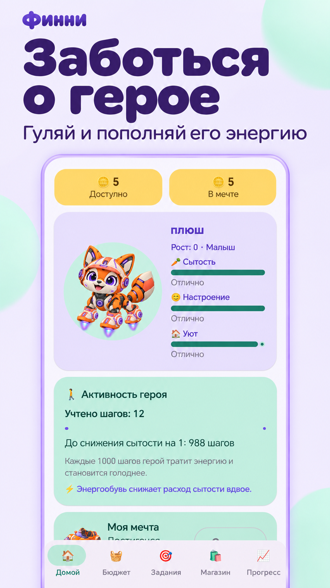
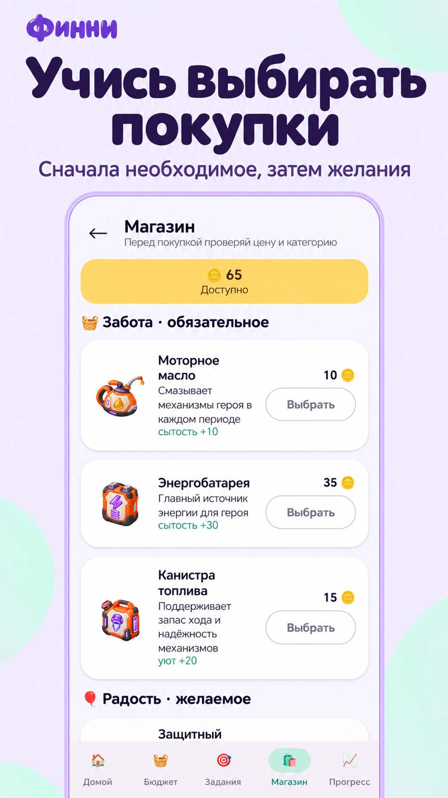
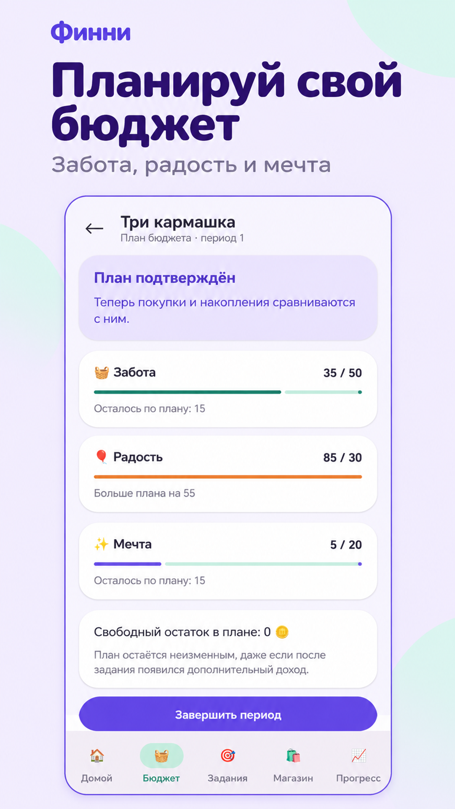
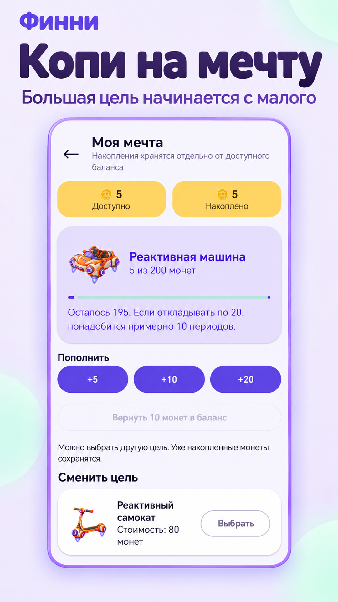
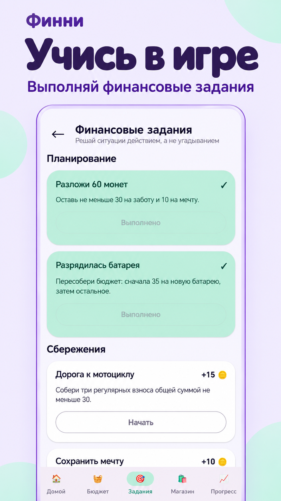
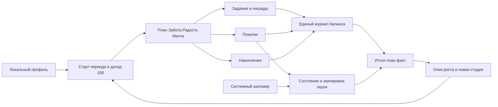
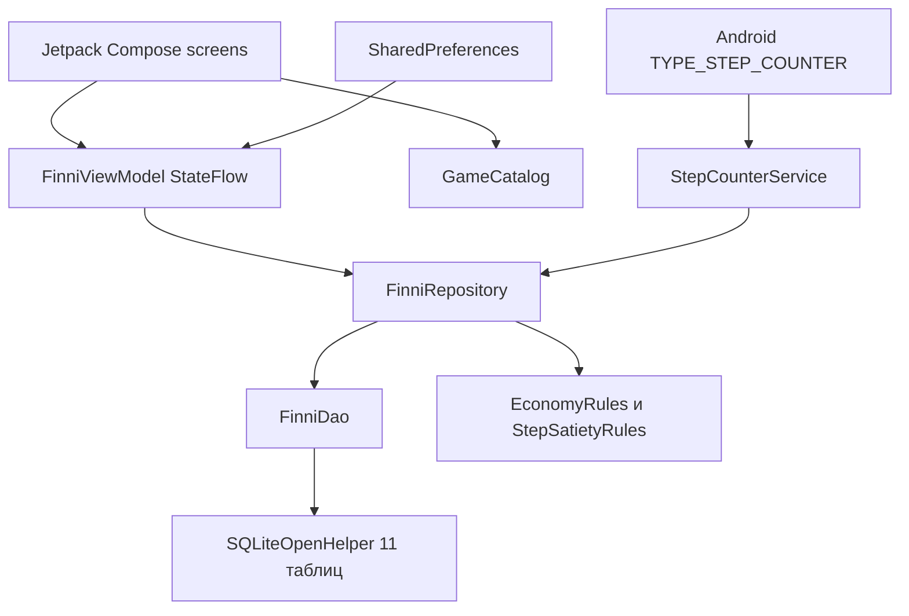
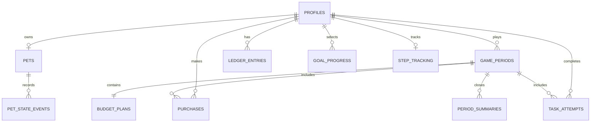

# Финни Три кармашка

<p align="center">
  
  
  
  
  
</p>

Функциональный офлайн-прототип Android-приложения для формирования базовых финансовых навыков у детей 7–11 лет. Ребенок создает робота-питомца, получает игровую валюту, заранее распределяет ее между обязательными расходами, желаемыми покупками и накоплениями, а затем видит последствия своих решений для баланса, цели и развития героя.

Приложение не использует реальные деньги, рекламу, регистрацию, сервер или персональные финансовые рекомендации. Все игровые данные хранятся только на устройстве.

> Статус прототипа: основной сквозной сценарий и каталог из восьми товаров реализованы. До формальной финальной сдачи нужно настроить выпуск подписанного release APK и провести чистый сквозной прогон. Подробности приведены в [матрице соответствия](#матрица-соответствия-требованиям)

Отдельная версия документации для печати: [docs/Finni-technical-documentation.docx](docs/Finni-technical-documentation.pdf).

## Содержание

- [Назначение и возможности](#назначение-и-возможности)
- [Состав репозитория](#состав-репозитория)
- [Быстрый запуск](#быстрый-запуск)
- [Окружение и версии](#окружение-и-версии)
- [Сборка release APK](#сборка-release-apk)
- [Демонстрационный сценарий](#демонстрационный-сценарий)
- [Функциональная архитектура](#функциональная-архитектура)
- [Компонентная архитектура](#компонентная-архитектура)
- [Структура данных](#структура-данных)
- [Правила игровой экономики](#правила-игровой-экономики)
- [Матрица соответствия требованиям](#матрица-соответствия-требованиям)
- [Карта образовательного контента](#карта-образовательного-контента)
- [UX UI и доступность](#ux-ui-и-доступность)
- [Разрешения данные и удаление профиля](#разрешения-данные-и-удаление-профиля)
- [Тестирование](#тестирование)

## Назначение и возможности

Цель продукта — через безопасный игровой цикл научить ребенка:

- понимать ограниченность бюджета и не тратить больше доступной суммы;
- отличать обязательное от желаемого;
- составлять простой план и сравнивать его с фактом;
- регулярно откладывать на понятную краткосрочную цель;
- объяснять, как решение изменило баланс, накопления и состояние питомца.

В прототипе реализованы:

- локальный гостевой профиль без телефона, e-mail и реального имени;
- обычный и демонстрационный режимы;
- три персонажа, три цветовые темы и аксессуары;
- главный экран с балансом, накоплениями, целью, заданием, состоянием и шагами;
- бюджет «Забота / Радость / Мечта» с проверкой суммы и сравнением план/факт;
- 7 покупок двух категорий с ценой, подтверждением и игровым эффектом;
- 4 финансовые цели, пополнение и подтвержденное снятие накоплений;
- 6 интерактивных заданий по планированию, сбережениям и покупкам;
- 3 стадии развития героя: Малыш, Исследователь, Знаток;
- неограниченная последовательность игровых периодов без календарного ожидания;
- локальная история операций, покупок, заданий и итогов периодов;
- раздел взрослого с арифметическим барьером, настройками и удалением данных;
- фоновый учет шагов через аппаратный шагомер Android;
- экипировка, меняющая внешний вид и игровую механику: шлем, смарт-очки, энергообувь и реактивный рюкзак.

## Состав репозитория

```text
.
├── app/
│   ├── build.gradle.kts                  конфигурация Android-приложения
│   └── src/
│       ├── main/
│       │   ├── AndroidManifest.xml       разрешения и компоненты Android
│       │   ├── java/.../finni/
│       │   │   ├── MainActivity.kt       вход, запрос разрешения шагомера
│       │   │   ├── data/                 SQLite, DAO, репозиторий, настройки, шаги
│       │   │   ├── domain/               модели, каталог, экономика и рост
│       │   │   └── ui/                   ViewModel, навигация, Compose UI
│       │   └── res/                      локальные изображения, темы, XML
│       └── test/                         модульные тесты правил
├── docs/
│   ├── concept-finni.md                  исходная продуктовая концепция
│   ├── android-architecture.md           целевая архитектурная проработка
│   ├── robot-character-generation-brief.md ТЗ на иллюстрации
│   └── Finni-technical-documentation.docx печатная версия документации
├── gradle/libs.versions.toml             каталог версий зависимостей
├── gradle/wrapper/                       фиксированная версия Gradle
├── build.gradle.kts                      корневая конфигурация
├── settings.gradle.kts                   состав Gradle-проекта
└── README.md
```

Фактически проект состоит из одного Gradle-модуля `:app`. Папки `data`, `domain` и `ui` являются логическими слоями внутри модуля. Документ [docs/android-architecture.md](docs/android-architecture.md) описывает также возможное дальнейшее разбиение на модули и переход на Room; это целевая архитектура, а не описание уже выполненной миграции.

## Быстрый запуск

### Через Android Studio

1. Откройте корневую папку репозитория в Android Studio.
2. Дождитесь Gradle Sync и установки Android SDK 37, если IDE предложит это сделать.
3. Подключите устройство с Android 8.0+ и включенной USB-отладкой либо создайте эмулятор API 26+.
4. Выберите конфигурацию `app` и нажмите Run.
5. Для полного сценария на устройстве со счетчиком шагов разрешите доступ к физической активности по запросу приложения.

### Из терминала

```bash
./gradlew testDebugUnitTest lintDebug assembleDebug
adb install -r app/build/outputs/apk/debug/app-debug.apk
```

Если `adb` не находится в `PATH`, используйте абсолютный путь из Android SDK, например `$ANDROID_SDK_ROOT/platform-tools/adb`.

## Окружение и версии

| Компонент | Требование проекта |
|---|---|
| ОС разработчика | macOS, Linux или Windows с поддержкой Android Studio |
| Android Studio | версия с поддержкой AGP 9.3.x |
| JDK | 17 рекомендуется для запуска Gradle; байткод приложения — Java 11 |
| Android Gradle Plugin | 9.3.2 |
| Gradle Wrapper | 9.5.0 |
| Kotlin | 2.2.10 |
| Compile SDK | 37 |
| Target SDK | 37 |
| Min SDK | 26, Android 8.0 |
| Compose BOM | 2026.02.01 |
| AndroidX Activity Compose | 1.13.0 |
| Lifecycle Runtime | 2.11.0 |
| Lifecycle ViewModel Compose | 2.10.0 |
| JUnit | 4.13.2 |

Точные значения зафиксированы в [app/build.gradle.kts](app/build.gradle.kts), [gradle/libs.versions.toml](gradle/libs.versions.toml) и [gradle-wrapper.properties](gradle/wrapper/gradle-wrapper.properties).

Проверка окружения:

```bash
java -version
./gradlew --version
adb version
```

## Сборка release APK

### Проверенная сборка неподписанного release

1. Установите JDK 17 и Android SDK 37.
2. Укажите SDK в `local.properties`, если Android Studio не сделал это автоматически:

   ```properties
   sdk.dir=/absolute/path/to/Android/sdk
   ```

3. Запустите проверки и сборку:

   ```bash
   ./gradlew clean testDebugUnitTest lintDebug assembleRelease
   ```

4. Неподписанный файл появится в каталоге:

   ```text
   app/build/outputs/apk/release/app-release-unsigned.apk
   ```

### Подписанный APK для конкурсной сдачи


```

Для установки:

```bash
adb install -r /path/to/app-release.apk
```

APK можно скачать в RuStore по ссылке https://www.rustore.ru/catalog/app/com.mikhailskiy.finni
Или готовый артефакт можно скачать прямо здесь 

Текущие идентификаторы сборки: `applicationId = com.mikhailskiy.finni`, `versionName = 1.0`, `versionCode = 1`.

## Демонстрационный сценарий

1. Запустить приложение и выбрать «Демо для эксперта».
2. Убедиться, что создан локальный профиль без регистрации, а на главном экране видны герой, 100 монет, состояние и текущий шаг.
3. Открыть «Бюджет», распределить 50 / 25 / 20 по трем кармашкам и подтвердить план.
4. Выполнить задание «Разложи 60 монет» и получить 15 игровых монет с объяснением источника.
5. Купить обязательный товар и желаемый предмет. Перед каждой покупкой проверить цену, категорию и эффект.
6. Повторить покупку при недостатке средств и проверить объяснение дефицита.
7. Выбрать цель в «Моя мечта», внести 20 монет, затем открыть подтверждение возврата 10 монет.
8. На устройстве со счетчиком шагов включить физическую активность и проверить обновление прогресса шагов.
9. Завершить период, открыть сравнение план/факт и объяснение начисленных очков роста.
10. Начать следующий период. Для проверки роста повторить цикл до 30 и 70 очков.
11. Закрыть и снова открыть приложение — состояние должно сохраниться.
12. Открыть «Взрослым», решить `17 + 6`, посмотреть прогресс и сбросить демопрофиль.

## Функциональная архитектура

Основной цикл:



Навигация реализована собственным локальным стеком состояний в [FinniApp.kt](app/src/main/java/com/mikhailskiy/finni/ui/FinniApp.kt). Основные экраны:

| Поток | Экраны |
|---|---|
| Первый запуск | Intro → CreateProfile → CreatePet |
| Игровой цикл | Home → Budget / Tasks / Shop / Savings → Summary |
| Обучение | TaskPlay, Help, Progress |
| Взрослый | AdultGate → Adult |

## Компонентная архитектура



| Компонент | Ответственность | Реализация |
|---|---|---|
| UI | Экраны, подтверждения, краткая обратная связь, навигация | [ui](app/src/main/java/com/mikhailskiy/finni/ui) |
| State holder | Загрузка снимка игры, busy/error state, вызов use cases | [FinniViewModel.kt](app/src/main/java/com/mikhailskiy/finni/ui/FinniViewModel.kt) |
| Домен | Каталог, модели, формулы и ограничения | [domain](app/src/main/java/com/mikhailskiy/finni/domain) |
| Репозиторий | Транзакции игровых операций и сборка `GameSnapshot` | [FinniRepository.kt](app/src/main/java/com/mikhailskiy/finni/data/FinniRepository.kt) |
| DAO и БД | SQL-запросы, ограничения, миграции, каскадное удаление | [FinniDao.kt](app/src/main/java/com/mikhailskiy/finni/data/FinniDao.kt), [FinniDatabase.kt](app/src/main/java/com/mikhailskiy/finni/data/FinniDatabase.kt) |
| Шагомер | Foreground service, дельта системного счетчика, обновление сытости | [StepCounterService.kt](app/src/main/java/com/mikhailskiy/finni/data/StepCounterService.kt) |
| Настройки | Звуки и уменьшение анимации | [SettingsRepository.kt](app/src/main/java/com/mikhailskiy/finni/data/SettingsRepository.kt) |

### Серверная часть и OpenAPI

Серверной части нет. Приложение не содержит разрешения `INTERNET`, сетевого клиента и удаленного хранилища. Поэтому схема серверного развертывания и спецификация OpenAPI не применимы. Развертывание продукта — сборка, подпись и установка APK.

## Структура данных

SQLite-схема версии 5 находится в [FinniDatabase.kt](app/src/main/java/com/mikhailskiy/finni/data/FinniDatabase.kt), модели строк — в [Entities.kt](app/src/main/java/com/mikhailskiy/finni/data/Entities.kt). Внешние ключи включены, дочерние данные профиля удаляются каскадно.



| Таблица | Ключевые данные | Назначение |
|---|---|---|
| `profiles` | nickname, avatar_id, is_demo | Один локальный игровой профиль |
| `pets` | вид, цвет, экипировка, стадия, рост, сытость, настроение, уют | Текущее состояние героя |
| `game_periods` | номер, шаблон, версия контента, статус, начальные остатки | Последовательность игровых циклов |
| `budget_plans` | база, обязательное, желаемое, накопления, остаток, статус | Подтвержденный план периода |
| `ledger_entries` | тип операции, две дельты, остатки после, источник, объяснение | Единственный журнал движения валюты |
| `purchases` | снимок названия, категории, цены и эффектов | История покупок независимо от будущих изменений каталога |
| `goal_progress` | цель, стоимость, статус, время выбора и завершения | Выбранная финансовая цель |
| `task_attempts` | задание, версия контента, действия, награда, результат | Учебный прогресс и аудит награды |
| `pet_state_events` | причина, дельты и значения после | Объяснимая история изменения героя |
| `period_summaries` | доход, план/факт, накопления, оценки, рост, текст | Неизменяемый итог периода |
| `step_tracking` | показание датчика, учтенные и неполные шаги | Защита от повторного учета шагов |

### Логические структуры

- **Профиль:** `ProfileEntity` + один `PetEntity` + `AppSettings`.
- **Экономика:** `LedgerEntryEntity` является источником истины для доступного баланса и накоплений; `PurchaseEntity` хранит снимок покупки.
- **Задания:** определения находятся в `GameCatalog.tasks`, результаты — в `task_attempts`.
- **Прогресс:** `goal_progress`, `period_summaries`, `pet_state_events`, `step_tracking` и поля роста питомца.
- **Снимок UI:** репозиторий агрегирует состояние в `GameSnapshot`, чтобы экран получал согласованные данные одной загрузкой.

## Правила игровой экономики

### Баланс

После каждой операции журнал хранит дельту и итог:

```text
available_after = available_before + available_delta
savings_after   = savings_before   + savings_delta
```

| Операция | available_delta | savings_delta |
|---|---:|---:|
| Старт периода | +100 | 0 |
| Награда за задание | +10 или +15 | 0 |
| Покупка | −price | 0 |
| Взнос в цель | −amount | +amount |
| Возврат из накоплений | +amount | −amount |

Отрицательный доступный баланс и снятие больше накопленной суммы блокируются до записи операции. `operation_key` уникален и защищает от повторного применения одной транзакции.

### Бюджет

```text
required ≥ 0
optional ≥ 0
savings ≥ 0
required + optional + savings ≤ base_available
buffer = base_available − required − optional − savings
```

План редактируется только в статусе `DRAFT`. После подтверждения он становится базой сравнения с фактическими покупками и взносами.

### Состояние героя

Каждая покупка добавляет заданные каталогом дельты, затем показатель ограничивается диапазоном `0..100`:

```text
state_after = clamp(state_before + item_delta, 0, 100)
```

Обязательные товары повышают сытость или уют. Смарт-очки повышают настроение на 30, а стильные наушники — на 25. В начале нового периода настроение и уют уменьшаются на 5, но не ниже 20; ранее достигнутый рост не отнимается.

### Шаги и сытость

```text
threshold = 500 + (shoes ? 500 : 0) + (jetpack ? 1000 : 0)
accumulated = pending_steps + new_steps
satiety_loss = floor(accumulated / threshold)
pending_steps_after = accumulated mod threshold
satiety_after = max(0, satiety_before − satiety_loss)
```

| Экипировка | Шагов на −1 сытости |
|---|---:|
| Нет | 500 |
| Энергообувь | 1 000 |
| Реактивный рюкзак | 1 500 |
| Обувь и рюкзак | 2 000 |

Первое показание Android `TYPE_STEP_COUNTER` становится базовой точкой и не уменьшает сытость. Если системный счетчик сбросился после перезагрузки устройства, приложение обновляет базу без отрицательной дельты.

### Рост

За завершенный период начисляется от 0 до 20 очков:

```text
growth = essentials + follows_plan + saves_regularly

essentials      = 10, если куплен хотя бы один обязательный товар, иначе 0
follows_plan    = 5, если факт обязательных ≤ плану и факт желаемых ≤ плану, иначе 0
saves_regularly = 5, если взносы в периоде ≥ плану накоплений, иначе 0
```

| Стадия | Диапазон очков |
|---|---:|
| Малыш | 0–29 |
| Исследователь | 30–69 |
| Знаток | 70+ |

### Цель

```text
remaining = max(0, target − savings)
estimated_periods = ceil(remaining / max(planned_savings, 5))
```

Это не календарный прогноз, а понятная оценка количества игровых периодов при сохранении выбранного темпа.

## Матрица соответствия требованиям

Статусы относятся к текущему состоянию репозитория. «Частично» означает, что основной сценарий работает, но формальный критерий выполнен не полностью или не подтвержден измерением.

| Требование исходного ТЗ | Статус | Подтверждение |
|---|---|---|
| 2.5.1 Первый запуск, три типа решений, гостевой профиль, повторная подсказка | Реализовано | [OnboardingScreens.kt](app/src/main/java/com/mikhailskiy/finni/ui/screens/OnboardingScreens.kt), `Intro`, `Help` |
| 2.5.2 Настройка внешнего вида и имя питомца | Реализовано | [OnboardingScreens.kt](app/src/main/java/com/mikhailskiy/finni/ui/screens/OnboardingScreens.kt), `CreatePetScreen` |
| 2.5.3 Сводный главный экран и доступ ко всем разделам | Реализовано | [HomeScreen.kt](app/src/main/java/com/mikhailskiy/finni/ui/screens/HomeScreen.kt), [FinniApp.kt](app/src/main/java/com/mikhailskiy/finni/ui/FinniApp.kt) |
| 2.5.4 Игровая валюта, доход и объяснимые начисления | Реализовано | [FinniRepository.kt](app/src/main/java/com/mikhailskiy/finni/data/FinniRepository.kt), `startPeriodLocked`, `completeTask` |
| 2.5.5 План минимум по трем направлениям, лимит, остаток и план/факт | Реализовано | [BudgetScreen.kt](app/src/main/java/com/mikhailskiy/finni/ui/screens/BudgetScreen.kt), [GameModels.kt](app/src/main/java/com/mikhailskiy/finni/domain/GameModels.kt) |
| 2.5.6 Два типа покупок, цена, влияние, подтверждение, история, защита баланса | Реализовано | [ShopScreen.kt](app/src/main/java/com/mikhailskiy/finni/ui/screens/ShopScreen.kt), `FinniRepository.purchase` |
| 2.5.7 Цели, прогресс, регулярные взносы, понятный срок, подтверждение снятия | Реализовано | [SavingsScreen.kt](app/src/main/java/com/mikhailskiy/finni/ui/screens/SavingsScreen.kt) |
| 2.5.8 Минимум 3 темы, действие и последствия, объяснение, демодоступ | Реализовано | [TaskScreens.kt](app/src/main/java/com/mikhailskiy/finni/ui/screens/TaskScreens.kt), 6 заданий / 3 темы |
| 2.5.9 Обратная связь, причина и безопасное восстановление | Реализовано | баннеры `GameResult`, retry-тексты заданий, подсказка при нехватке средств |
| 2.5.10 Три стадии и развитие по серии решений | Реализовано | `EconomyRules.growthAward`, `GrowthStage`, `SummaryScreen` |
| 2.5.11 История, цель, завершенные задания и словарь | Реализовано | [ProgressAndAdultScreens.kt](app/src/main/java/com/mikhailskiy/finni/ui/screens/ProgressAndAdultScreens.kt) |
| 2.5.12 Защищенный раздел взрослого и нейтральный прогресс | Реализовано | `AdultGateScreen`, `AdultScreen` |
| 2.5.13 Сохранение и сбрасываемый демонстрационный профиль | Реализовано | SQLite + `createDemoProfile` / `resetDemoProfile` / `deleteProfile` |
| 2.5.14 Добавление контента без изменения основной логики | Реализовано с ограничением | [GameCatalog.kt](app/src/main/java/com/mikhailskiy/finni/domain/GameCatalog.kt); новые задания в рамках трех существующих механик |
| 2.6 Не менее 9 визуальных комбинаций питомца | Реализовано | 3 персонажа × 3 цветовых фона; `demoContentMeetsMinimumVolume` |
| 2.6 Не менее 5 последовательных периодов | Реализовано | `startNextPeriod`, циклические шаблоны `period_1..period_5` без ожидания |
| 2.6 Не менее 6 заданий по 3 темам | Реализовано | `GameCatalog.tasks`, `demoContentMeetsMinimumVolume` |
| 2.6 Не менее 8 покупок двух типов | Реализовано | 8 позиций; [GameCatalog.kt](app/src/main/java/com/mikhailskiy/finni/domain/GameCatalog.kt), `demoContentMeetsMinimumVolume` |
| 2.6 Не менее 3 целей | Реализовано | 4 цели; `transportGoalsHaveIncreasingPrices` |
| 2.6 Не менее 3 стадий роста | Реализовано | `GrowthStage`, `growthStageBoundariesAreStable` |
| 3.1 Android 8+, офлайн-цикл, необязательный шагомер | Реализовано | `minSdk 26`, отсутствие `INTERNET`, optional feature в Manifest |
| 3.3 Подписанный release APK | **Не завершено** | release-вариант есть, но `signingConfig` и финальный подписанный артефакт не настроены |
| 3.4 Автотесты ключевой логики | Частично | [EconomyRulesTest.kt](app/src/test/java/com/mikhailskiy/finni/EconomyRulesTest.kt); нет instrumented/UI и миграционных тестов |
| 3.4 Запуск ≤5 с, отклик ≤1 с, отсутствие сбоев | Частично | блокирующих ошибок в ручном smoke-тесте не выявлено; формальные замеры и длительный прогон не выполнены |
| 3.5 Без аккаунтов, рекламы, реальных платежей и внешних ссылок | Реализовано | Manifest и локальная архитектура |
| 3.6 Детский UX и настройки доступности | Частично | крупные основные действия, текстовые статусы, sound/reduced motion; нужен аудит TalkBack и масштабов шрифта |

## Карта образовательного контента

| Тема | Ожидаемый навык | Сценарий | Правильная логика | Объяснение ребенку |
|---|---|---|---|---|
| Планирование | Распределить ограниченный доход | «Разложи 60 монет» | Забота ≥30, Мечта ≥10, сумма ≤60 | Сначала защити нужное и оставь часть для мечты |
| Планирование | Пересобрать план при неожиданности | «Разрядилась батарея» | Забота ≥35, Мечта ≥10, сумма ≤60 | Когда появилось важное, желаемое можно перенести |
| Сбережения | Делать регулярные небольшие взносы | «Дорога к мотоциклу» | Не менее 3 взносов, вместе ≥30 | Несколько маленьких шагов тоже приближают цель |
| Сбережения | Выбрать регулярность вместо импульса | «Сохранить мечту» | Не менее 3 выбранных взносов и сумма ≥30 | Регулярность помогает заранее понимать путь к цели |
| Покупки | Поставить обязательное выше желаемого | «Заряди героя» | Выбрать масло и батарею, сумма ≤50 | Сначала покупаем то, без чего герой не сможет работать |
| Покупки | Сравнить состав и цену корзины | «Набор заботы» | Не менее 2 обязательных товаров, сумма ≤55 | Проверяй не только цену одного товара, но и всю корзину |
| План и факт | Оценить свое решение | Итог периода | Сравнить три плановых значения с фактическими | План показывает намерение, факт — что получилось на самом деле |
| Финансовая цель | Оценить остаток и темп | Экран «Моя мечта» | Остаток = цена − накопления; срок зависит от регулярного взноса | Чем регулярнее откладываешь, тем понятнее путь к мечте |
| Ограниченный бюджет | Отказаться от недоступной покупки | Попытка покупки при нехватке | Не уходить в минус; выбрать дешевле, выполнить задание или перенести | Не купить сейчас — нормально: можно выбрать другой следующий шаг |

Определения и параметры заданий сосредоточены в [GameCatalog.kt](app/src/main/java/com/mikhailskiy/finni/domain/GameCatalog.kt), а интерактивные механики — в [TaskScreens.kt](app/src/main/java/com/mikhailskiy/finni/ui/screens/TaskScreens.kt).

## UX UI и доступность

### Обоснование решений

- **Три кармашка.** Детские названия «Забота», «Радость», «Мечта» сохраняют финансовый смысл обязательных, необязательных расходов и накоплений.
- **Один следующий шаг.** Главный экран показывает контекст и выделяет ближайшее действие: составить план, выполнить задание или подвести итог.
- **Объяснимая экономика.** Цена, категория, эффект и остаток показываются до покупки; после операции выводится причина изменения.
- **Безопасная ошибка.** Неверное решение не отнимает накопленный рост и сопровождается способом исправления.
- **Питомец как обратная связь.** Финансовое действие сразу отражается в состоянии, экипировке или росте персонажа.
- **Отдельная зона взрослого.** Арифметический барьер снижает риск случайного удаления прогресса, а формулировки избегают негативной оценки ребенка.

### Реализованные настройки и приемы

- системный sans-serif без загружаемого пользовательского шрифта;
- основной текст 16 sp, заголовки 17–30 sp; вспомогательный текст местами 14–15 sp;
- основные кнопки ключевого сценария имеют высоту 56 dp;
- категория и результат передаются текстом и иконкой, а не только цветом;
- изображения персонажей и товаров имеют `contentDescription`;
- критические сообщения дублируются текстом;
- настройка «Звуки» и настройка «Меньше анимации» в разделе взрослого;
- единая стрелка назад и единообразная структура заголовков;
- подтверждение снятия накоплений, сброса и удаления профиля.

### Что требует дополнительной проверки

- полный обход TalkBack и порядок фокуса;
- читаемость при системном масштабе шрифта 1.3–2.0;
- контраст всех вторичных подписей по WCAG;
- отсутствие обрезания на ширине 360 dp;
- фактическое применение `soundEnabled` и `reducedMotion` ко всем будущим звукам и анимациям: сейчас звуковых файлов и сложных анимаций нет.

## Разрешения данные и удаление профиля

### Android-разрешения

| Разрешение / feature | Зачем | Поведение без него |
|---|---|---|
| `ACTIVITY_RECOGNITION` | Доступ к системному счетчику шагов на Android 10+ | Финансовый цикл работает, карточка активности предлагает разрешить доступ |
| `FOREGROUND_SERVICE` | Продолжение учета шагов в foreground service | Фоновый учет шагов не запускается |
| `FOREGROUND_SERVICE_HEALTH` | Тип foreground service для физической активности на новых Android | Фоновый учет шагов ограничен системой |
| `android.hardware.sensor.stepcounter` с `required=false` | Объявляет необязательное использование шагомера | Устройство без датчика поддерживается без механики шагов |

`INTERNET`, камера, микрофон, геолокация, контакты и Bluetooth не запрашиваются.

### Какие данные собираются

Под «сбором» здесь понимается локальное сохранение на устройстве; передачи разработчику или третьим лицам нет.

- игровое имя профиля и имя питомца;
- выбранный персонаж, цвет и экипировка;
- бюджетные планы и игровой журнал операций;
- покупки, выбранная цель и накопления;
- выполненные задания и снимки игровых действий;
- состояния, рост и итоги периодов;
- суммарная дельта шагов, остаток шагов до следующего изменения сытости и последнее системное показание датчика;
- настройки звука и уменьшения анимации.

Не собираются реальное имя, телефон, e-mail, дата рождения, геолокация, платежные реквизиты, семейный бюджет, рекламный идентификатор или аналитические события. Android backup отключен в Manifest и XML-правилах извлечения данных.

### Удаление профиля

1. На главном экране нажать «Взрослым».
2. Решить пример `17 + 6`.
3. Нажать «Удалить локальный профиль».
4. Прочитать предупреждение и подтвердить удаление.

`FinniRepository.deleteProfile()` удаляет корневую запись профиля; связанные игровые таблицы очищаются каскадно. Настройки `SharedPreferences` не являются частью игрового профиля и остаются до очистки данных приложения средствами Android. Для демопрофиля доступна отдельная подтверждаемая команда сброса.

## Тестирование

### Автоматизированные проверки

```bash
./gradlew testDebugUnitTest
./gradlew lintDebug
```

Проверено 29 сентября 2026 года после добавления наушников: `testDebugUnitTest`, `lintDebug` и `assembleDebug` завершились `BUILD SUCCESSFUL`. Проверенная ранее команда `assembleRelease` создала неподписанный APK размером около 32 МБ.

Файл [EconomyRulesTest.kt](app/src/test/java/com/mikhailskiy/finni/EconomyRulesTest.kt) проверяет:

- допустимый и превышенный бюджет;
- запрет отрицательных значений плана;
- максимум 20 очков роста и отсутствие отрицательного роста;
- границы трех стадий;
- минимальный объем основного контента, включая не менее 8 товаров;
- удаленные позиции каталога;
- цели транспорта и рост их стоимости;
- категорию и эффект очков;
- цену рюкзака относительно обуви;
- расчет шагов, перенос остатка и обработку ошибочных значений;
- пороги с обувью, рюкзаком и их сочетанием.

### Ручные тест-кейсы

| ID | Проверка | Ожидаемый результат |
|---|---|---|
| TC-01 | Первый запуск и создание обычного профиля | Нет регистрации; после имени и персонажа открыт Home |
| TC-02 | Демо для эксперта | Стартовые данные воспроизводимы после сброса |
| TC-03 | План 50/25/20 при базе 100 | План подтвержден, остаток 5 |
| TC-04 | План с суммой больше базы | Подтверждение недоступно или показана ошибка |
| TC-05 | Правильное и неверное задание каждой темы | Есть объяснение; награда только за успешное завершение |
| TC-06 | Покупка обязательного товара | Баланс уменьшен, история и состояние обновлены |
| TC-07 | Покупка при нехватке | Баланс не изменен; показана недостающая сумма и варианты |
| TC-08 | Выбор цели и взнос | Доступный баланс уменьшается, накопления и прогресс растут |
| TC-09 | Возврат 10 из накоплений | До подтверждения показаны новый остаток и оценка срока |
| TC-10 | Завершение периода | Показаны план/факт, пояснение и 0–20 очков роста |
| TC-11 | Переход через 30 и 70 очков | Стадии меняются на Исследователь и Знаток |
| TC-12 | Перезапуск приложения | Баланс, цель, покупки и прогресс сохранены |
| TC-13 | Выдача разрешения шагомера | Сервис запускается, новые шаги учитываются без задвоения |
| TC-14 | Покупка обуви и рюкзака | Порог становится 1000, 1500 или 2000; изображение меняется |
| TC-15 | Раздел взрослого и удаление | Неверный ответ не пускает; удаление требует подтверждения |


## Сторонние компоненты и лицензии

| Компонент | Использование | Лицензия / статус |
|---|---|---|
| Kotlin | Язык и стандартная библиотека | Apache License 2.0 |
| Android Gradle Plugin и Gradle Wrapper | Сборка | Android SDK Terms / Apache License 2.0 для Gradle; проверить NOTICE дистрибутива |
| AndroidX Core, Activity, Lifecycle | Android API и жизненный цикл | Apache License 2.0 |
| Jetpack Compose Material 3 | UI | Apache License 2.0 |
| Kotlin Coroutines | Асинхронные операции и Flow | Apache License 2.0 |
| JUnit 4.13.2 | Unit-тесты | Eclipse Public License 1.0 |
| Системный sans-serif Android | Типографика | Поставляется ОС; отдельный файл шрифта не включен |
| Emoji | Вспомогательные системные глифы | Отрисовываются шрифтом ОС; не включены отдельными файлами |
| PNG персонажей, товаров и целей в `drawable-nodpi` | Иллюстрации интерфейса | Предоставлены владельцем проекта / сгенерированы для прототипа; точную лицензию и право распространения необходимо документально подтвердить |
| Звуки | Не используются | Файлы отсутствуют |

Полный граф транзитивных зависимостей можно получить командой:

```bash
./gradlew :app:dependencies
```

Перед публикацией рекомендуется сохранить отчет Gradle, тексты применимых лицензий и таблицу происхождения каждого медиафайла в репозитории.

## Дополнительные документы

- [Продуктовая концепция](docs/concept-finni.md)
- [Целевая Android-архитектура](docs/android-architecture.md)
- [ТЗ на генерацию персонажей](docs/robot-character-generation-brief.md)
