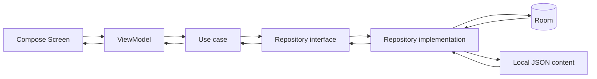
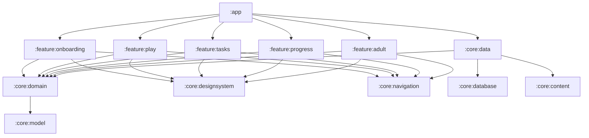
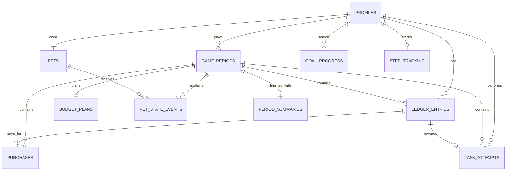

# Архитектура Android-приложения «Финни: Три кармашка»

## 1. Назначение документа

Документ переводит продуктовую концепцию в технический план реализации Android-приложения. Архитектура рассчитана на конкурсный прототип, который:

- полностью работает офлайн;
- сохраняет профиль, игровую экономику и прогресс после перезапуска;
- не допускает отрицательного баланса и повторной выдачи награды;
- позволяет добавлять задания и игровые товары без изменения основной логики;
- воспроизводит обязательный сценарий из пяти периодов в деморежиме;
- остаётся достаточно простой для разработки небольшой командой.

Текущий проект уже использует Kotlin, Jetpack Compose, `minSdk 26` и пакет `com.mikhailskiy.finni`. Предлагаемая структура развивает этот каркас без серверной части.

> Статус реализации: собираемый MVP использует штатный `SQLiteOpenHelper` с описанной ниже схемой и теми же транзакционными границами. Room остаётся целевым persistence-адаптером; его compiler-зависимости недоступны в текущем окружении из-за TLS-доступа к Maven. Замена адаптера не затрагивает domain-модели, use case или UI.

## 2. Архитектурные решения

### 2.1. Стиль архитектуры

Используется слоистая архитектура с однонаправленным потоком данных:



Основные правила:

1. Compose отображает `UiState` и отправляет пользовательские `Action`.
2. `ViewModel` не содержит правил игровой экономики.
3. Use case выполняет один законченный пользовательский сценарий.
4. Чистые правила находятся в domain-движках и тестируются без Android.
5. Репозитории скрывают Room и формат JSON от domain/UI.
6. Любое финансовое изменение записывается в журнал одной Room-транзакцией.
7. Навигация передаёт только идентификаторы, а не сериализованные доменные объекты.

### 2.2. Источники истины

| Данные | Источник истины |
|---|---|
| Доступный баланс и накопления | Последняя запись `ledger_entries` |
| План периода | `budget_plans` |
| Текущее состояние питомца | `pets` |
| Шаги и контрольное значение системного датчика | `step_tracking` |
| Объяснение изменений питомца | `pet_state_events` |
| История покупок | `purchases` + связанная запись журнала |
| Прогресс заданий | `task_attempts` |
| Итог завершённого периода | Неизменяемый снимок `period_summaries` |
| Каталог товаров, целей и заданий | Версионируемые JSON-файлы в assets |
| Звук, анимация и активный профиль | Preferences DataStore |

UI не хранит собственную копию баланса или прогресса. После команды экран получает обновлённое состояние через `Flow` из базы.

## 3. Gradle-модули

Рекомендуемая целевая структура состоит из 13 модулей. Feature-модули не зависят друг от друга; переходы между ними связывает `:app`.

```text
:app

:core:model
:core:domain
:core:database
:core:content
:core:data
:core:designsystem
:core:navigation

:feature:onboarding
:feature:play
:feature:tasks
:feature:progress
:feature:adult
```

### 3.1. Ответственность модулей

| Модуль | Ответственность | Основные зависимости |
|---|---|---|
| `:app` | `Application`, `MainActivity`, DI-композиция, корневой `NavHost`, выбор стартового графа | Все feature-модули, `core:data`, `core:navigation` |
| `:core:model` | Чистые модели: `Coins`, `Wallet`, `Budget`, `PetState`, `Period`, enum-классы | Kotlin stdlib |
| `:core:domain` | Интерфейсы репозиториев, use case, правила бюджета, роста и накоплений | `core:model`, Coroutines |
| `:core:database` | Room database, Entity, DAO, миграции, database transaction runner | Room |
| `:core:content` | Чтение и проверка JSON, DTO каталога и учебного контента | Kotlin Serialization, Android assets |
| `:core:data` | Реализации репозиториев, мапперы, координация Room-транзакций и контента | `model`, `domain`, `database`, `content`, DataStore |
| `:core:designsystem` | Тема, типографика, цвета, иконки, доступные компоненты и превью | Compose Material 3 |
| `:core:navigation` | Типобезопасные route-контракты и общие аргументы переходов | Navigation Compose, Serialization |
| `:feature:onboarding` | Знакомство, создание локального профиля и питомца | `domain`, `model`, `designsystem`, `navigation` |
| `:feature:play` | Главный экран, бюджет, магазин, покупки, цель, накопления и итог периода | `domain`, `model`, `designsystem`, `navigation` |
| `:feature:tasks` | Список, проигрывание шаблонного задания, результат | `domain`, `model`, `designsystem`, `navigation` |
| `:feature:progress` | История периодов, развитие, завершённые задания, словарик | `domain`, `model`, `designsystem`, `navigation` |
| `:feature:adult` | Защитный барьер, сводка, настройки, сброс и удаление профиля | `domain`, `model`, `designsystem`, `navigation` |

### 3.2. Граф зависимостей



Запрещённые зависимости:

- feature → feature;
- domain → Android/Room/Compose;
- database → feature/UI;
- content → database;
- ViewModel → DAO напрямую.

### 3.3. Практичный порядок выделения модулей

Чтобы не остановить разработку инфраструктурой, модули выделяются в таком порядке:

1. `model`, `domain`, `database`, `data`, `designsystem`;
2. `feature:onboarding` и `feature:play` для первого вертикального сценария;
3. `feature:tasks`, `feature:progress`, `feature:adult`;
4. `content` и `navigation` можно временно держать внутри `data`/`app`, но до финальной сдачи вынести в указанные модули.

## 4. Предлагаемая структура исходников

```text
app/src/main/java/com/mikhailskiy/finni/
  FinniApplication.kt
  MainActivity.kt
  FinniApp.kt
  di/AppModule.kt
  navigation/FinniNavHost.kt

core/model/src/main/java/.../
  money/Coins.kt
  budget/Budget.kt
  period/GamePeriod.kt
  pet/Pet.kt
  task/Task.kt

core/domain/src/main/java/.../
  repository/*.kt
  usecase/profile/*.kt
  usecase/period/*.kt
  usecase/economy/*.kt
  engine/BudgetRules.kt
  engine/GrowthRules.kt
  engine/SavingsRules.kt
  engine/TaskEvaluator.kt
  engine/FeedbackResolver.kt

core/database/src/main/java/.../
  FinniDatabase.kt
  entity/*.kt
  dao/*.kt
  migration/*.kt

core/content/src/main/
  java/.../ContentRepositoryImpl.kt
  java/.../dto/*.kt
  assets/content/manifest.json
  assets/content/tasks/*.json
  assets/content/shop_items.json
  assets/content/goals.json
  assets/content/period_templates.json
  assets/content/glossary.json

core/data/src/main/java/.../
  repository/*.kt
  mapper/*.kt
  transaction/*.kt
  datastore/AppPreferences.kt
  demo/DemoProfileManagerImpl.kt

feature/play/src/main/java/.../
  home/
  budget/
  shop/
  savings/
  summary/
  navigation/PlayGraph.kt
```

## 5. Domain-модель

### 5.1. Деньги

Во внешнем слое Room суммы хранятся как `Int`. В domain используется value object:

```kotlin
@JvmInline
value class Coins(val value: Int) {
    init {
        require(value >= 0)
    }
}
```

Отрицательные значения допустимы только у внутренних полей изменения `availableDelta` и `savingsDelta`. Суммы не используют `Float`/`Double`. Верхняя граница одной операции — 1 000 000 монет, что защищает прототип от переполнения и повреждённого контента.

### 5.2. Основные модели

```kotlin
data class Wallet(
    val available: Coins,
    val savings: Coins,
    val revision: Long,
)

data class BudgetPlan(
    val required: Coins,
    val optional: Coins,
    val savings: Coins,
    val buffer: Coins,
    val status: BudgetPlanStatus,
)

data class PetState(
    val satiety: Int,
    val mood: Int,
    val comfort: Int,
    val growthPoints: Int,
    val stage: GrowthStage,
)
```

`revision` равен `row_id` последней записи журнала. Он используется при подтверждении покупки или снятия накоплений, чтобы решение, показанное в диалоге, не применилось к уже изменившемуся балансу.

### 5.3. Чистые движки

| Компонент | Вход | Выход |
|---|---|---|
| `BudgetRules` | Баланс, черновик плана, обязательный минимум | Валидный план либо список понятных предупреждений |
| `PurchaseRules` | Кошелёк, товар, текущий период | `Allowed` или `InsufficientFunds(missing)` |
| `SavingsRules` | Кошелёк, цель, история взносов | Возможность операции и прогноз периодов |
| `GrowthRules` | Обязательные покупки, план/факт, накопления | 0–20 очков и новая стадия |
| `TaskEvaluator` | Определение задания и действия ребёнка | Результат шага, объяснение, завершённость |
| `FeedbackResolver` | Причина и числовые изменения | Ключ короткого безопасного сообщения |

Движки не получают `Context`, DAO или строковые ресурсы. Они возвращают коды сообщений и данные, которые UI преобразует в локализованный текст.

## 6. Room-схема

### 6.1. Общие соглашения

- База: `finni.db`.
- Текущая версия схемы: `5`; миграция `1 → 2` добавляет таблицу шагомера, `2 → 3` — постоянный признак энергообуви и переменный порог шагов, `3 → 4` — признак смарт-очков, а `4 → 5` — признак реактивного рюкзака. Все миграции сохраняют профиль.
- Идентификаторы доменных объектов: UUID в `TEXT`.
- Порядок финансовых операций: автоинкрементный `INTEGER row_id`.
- Время: Unix epoch millis в UTC (`INTEGER`).
- Enum: строковое значение через `TypeConverter` для читаемости и безопасных миграций.
- Все внешние ключи включены; данные профиля удаляются каскадно.
- Схема Room экспортируется в `schemas/` и хранится в репозитории.
- `fallbackToDestructiveMigration()` в release-сборке не используется.

### 6.2. Таблица `profiles`

```text
profile_id       TEXT PRIMARY KEY
nickname         TEXT NOT NULL
avatar_id        TEXT NOT NULL
is_demo          INTEGER NOT NULL
created_at       INTEGER NOT NULL
updated_at       INTEGER NOT NULL
```

Ограничения уровня domain: псевдоним 1–16 символов после `trim`, без необходимости вводить настоящее имя.

### 6.3. Таблица `pets`

```text
pet_id           TEXT PRIMARY KEY
profile_id       TEXT NOT NULL UNIQUE REFERENCES profiles(profile_id) ON DELETE CASCADE
name             TEXT NOT NULL
species_id       TEXT NOT NULL
color_id         TEXT NOT NULL
accessory_id     TEXT NULL
has_shoes        INTEGER NOT NULL DEFAULT 0
has_glasses      INTEGER NOT NULL DEFAULT 0
has_jetpack      INTEGER NOT NULL DEFAULT 0
stage            TEXT NOT NULL
growth_points    INTEGER NOT NULL
satiety          INTEGER NOT NULL
mood             INTEGER NOT NULL
comfort          INTEGER NOT NULL
updated_at       INTEGER NOT NULL
```

Индексы: уникальный `profile_id`. Показатели состояния ограничиваются domain-логикой диапазоном `0..100`. Очки роста не уменьшаются.

### 6.4. Таблица `game_periods`

```text
period_id          TEXT PRIMARY KEY
profile_id         TEXT NOT NULL REFERENCES profiles(profile_id) ON DELETE CASCADE
period_number      INTEGER NOT NULL
template_id        TEXT NOT NULL
content_version    TEXT NOT NULL
status             TEXT NOT NULL
opening_available  INTEGER NOT NULL
opening_savings    INTEGER NOT NULL
started_at         INTEGER NOT NULL
completed_at       INTEGER NULL
```

Индексы:

- `UNIQUE(profile_id, period_number)`;
- `INDEX(profile_id, status)`.

Статусы: `DRAFT`, `ACTIVE`, `READY_TO_CLOSE`, `COMPLETED`. Одновременно разрешён только один незавершённый период профиля; это проверяет транзакция `StartPeriod`.

### 6.5. Таблица `budget_plans`

```text
period_id          TEXT PRIMARY KEY REFERENCES game_periods(period_id) ON DELETE CASCADE
base_available     INTEGER NOT NULL
required_planned   INTEGER NOT NULL
optional_planned   INTEGER NOT NULL
savings_planned    INTEGER NOT NULL
buffer_planned     INTEGER NOT NULL
status             TEXT NOT NULL
confirmed_at       INTEGER NULL
updated_at         INTEGER NOT NULL
```

Статусы: `DRAFT`, `CONFIRMED`. DAO изменяет суммы только запросом с условием `WHERE status = 'DRAFT'`. После подтверждения план становится неизменяемым.

### 6.6. Таблица `ledger_entries`

```text
row_id             INTEGER PRIMARY KEY AUTOINCREMENT
entry_id           TEXT NOT NULL UNIQUE
operation_key      TEXT NOT NULL UNIQUE
profile_id         TEXT NOT NULL REFERENCES profiles(profile_id) ON DELETE CASCADE
period_id          TEXT NULL REFERENCES game_periods(period_id) ON DELETE CASCADE
operation_type     TEXT NOT NULL
budget_category    TEXT NULL
available_delta    INTEGER NOT NULL
savings_delta      INTEGER NOT NULL
available_after    INTEGER NOT NULL
savings_after      INTEGER NOT NULL
source_id          TEXT NULL
explanation_key    TEXT NOT NULL
created_at         INTEGER NOT NULL
```

Индексы:

- `INDEX(profile_id, row_id)`;
- `INDEX(period_id, operation_type)`;
- уникальный `operation_key`.

Типы операций:

- `PERIOD_INCOME`;
- `TASK_REWARD`;
- `PURCHASE`;
- `SAVINGS_DEPOSIT`;
- `SAVINGS_WITHDRAWAL`;
- `GOAL_REDEEM`;
- `DEMO_ADJUSTMENT` — только в тестовом профиле.

Примеры изменений:

| Операция | `available_delta` | `savings_delta` |
|---|---:|---:|
| Доход | +100 | 0 |
| Покупка | −35 | 0 |
| Пополнение цели | −20 | +20 |
| Подтверждённое снятие | +10 | −10 |
| Завершение цели | 0 | −120 |

`operation_key` делает команду идемпотентной. Например, награда имеет ключ `task-reward:<attemptId>`, поэтому повторный tap или восстановление процесса не выдаст её дважды.

### 6.7. Таблица `purchases`

```text
purchase_id         TEXT PRIMARY KEY
profile_id          TEXT NOT NULL REFERENCES profiles(profile_id) ON DELETE CASCADE
period_id           TEXT NOT NULL REFERENCES game_periods(period_id) ON DELETE CASCADE
ledger_row_id       INTEGER NOT NULL UNIQUE REFERENCES ledger_entries(row_id) ON DELETE CASCADE
catalog_item_id     TEXT NOT NULL
title_key_snapshot  TEXT NOT NULL
category_snapshot   TEXT NOT NULL
price_snapshot      INTEGER NOT NULL
satiety_delta       INTEGER NOT NULL
mood_delta          INTEGER NOT NULL
comfort_delta       INTEGER NOT NULL
purchased_at        INTEGER NOT NULL
```

Цена, категория и эффекты сохраняются снимком, чтобы история не изменилась после обновления JSON-каталога.

### 6.8. Таблица `goal_progress`

```text
goal_progress_id    TEXT PRIMARY KEY
profile_id          TEXT NOT NULL REFERENCES profiles(profile_id) ON DELETE CASCADE
goal_id             TEXT NOT NULL
title_key_snapshot  TEXT NOT NULL
target_snapshot     INTEGER NOT NULL
status              TEXT NOT NULL
selected_at         INTEGER NOT NULL
completed_at        INTEGER NULL
savings_at_finish   INTEGER NULL
```

Статусы: `ACTIVE`, `PAUSED`, `COMPLETED`. Накопления являются единым кошельком, а цель объясняет их назначение. При выборе новой цели предыдущая активная запись переводится в `PAUSED`; накопленные монеты не исчезают.

### 6.9. Таблица `task_attempts`

```text
attempt_id            TEXT PRIMARY KEY
profile_id            TEXT NOT NULL REFERENCES profiles(profile_id) ON DELETE CASCADE
period_id             TEXT NULL REFERENCES game_periods(period_id) ON DELETE CASCADE
task_id               TEXT NOT NULL
content_version       TEXT NOT NULL
status                TEXT NOT NULL
result_code           TEXT NULL
actions_snapshot_json TEXT NOT NULL
reward                 INTEGER NOT NULL
reward_ledger_row_id   INTEGER NULL UNIQUE REFERENCES ledger_entries(row_id) ON DELETE SET NULL
started_at             INTEGER NOT NULL
completed_at           INTEGER NULL
```

Индексы: `INDEX(profile_id, task_id)` и `INDEX(period_id, status)`. Ошибочное действие не завершает попытку принудительно: оно добавляется в снимок действий, показывает объяснение и позволяет исправить решение.

### 6.10. Таблица `pet_state_events`

```text
event_id          TEXT PRIMARY KEY
pet_id            TEXT NOT NULL REFERENCES pets(pet_id) ON DELETE CASCADE
period_id         TEXT NULL REFERENCES game_periods(period_id) ON DELETE CASCADE
reason_type       TEXT NOT NULL
reason_id         TEXT NULL
satiety_delta     INTEGER NOT NULL
mood_delta        INTEGER NOT NULL
comfort_delta     INTEGER NOT NULL
growth_delta      INTEGER NOT NULL
satiety_after     INTEGER NOT NULL
mood_after        INTEGER NOT NULL
comfort_after     INTEGER NOT NULL
growth_after      INTEGER NOT NULL
message_key       TEXT NOT NULL
created_at        INTEGER NOT NULL
```

Таблица обеспечивает объяснимость: любое изменение на главном экране можно связать с покупкой, завершением периода или другим игровым событием.

### 6.11. Таблица `period_summaries`

```text
period_id             TEXT PRIMARY KEY REFERENCES game_periods(period_id) ON DELETE CASCADE
income_total          INTEGER NOT NULL
required_actual       INTEGER NOT NULL
optional_actual       INTEGER NOT NULL
savings_deposited     INTEGER NOT NULL
savings_withdrawn     INTEGER NOT NULL
closing_available     INTEGER NOT NULL
closing_savings       INTEGER NOT NULL
essentials_score      INTEGER NOT NULL
plan_score            INTEGER NOT NULL
savings_score         INTEGER NOT NULL
growth_awarded        INTEGER NOT NULL
feedback_key          TEXT NOT NULL
created_at            INTEGER NOT NULL
```

Сводка неизменяема. Она сохраняет исторический план/факт и результат даже при последующем изменении правил или контента.

### 6.12. Таблица `step_tracking`

```text
profile_id         TEXT PRIMARY KEY REFERENCES profiles(profile_id) ON DELETE CASCADE
last_sensor_total  INTEGER NULL
tracked_steps      INTEGER NOT NULL CHECK(tracked_steps >= 0)
pending_steps      INTEGER NOT NULL CHECK(pending_steps >= 0)
updated_at         INTEGER NOT NULL
```

`last_sensor_total` хранит последнее значение `TYPE_STEP_COUNTER`, которое Android считает с момента перезагрузки. В транзакции вычисляется только положительная разница, поэтому одни и те же шаги не уменьшают сытость повторно. При перезагрузке устройства уменьшившееся системное значение принимается как новая базовая точка. `pending_steps` переносит остаток до следующего порога: 500 шагов без улучшений, 1000 с энергообувью, 1500 с реактивным рюкзаком или 2000 с обоими предметами.

### 6.13. ER-диаграмма



## 7. DAO и реактивные запросы

DAO возвращают `Flow` только для наблюдаемых экраном данных. Одноразовые команды используют `suspend`.

Ключевые запросы:

```kotlin
@Query(
    """
    SELECT * FROM ledger_entries
    WHERE profile_id = :profileId
    ORDER BY row_id DESC
    LIMIT 1
    """
)
fun observeLatestWalletEntry(profileId: String): Flow<LedgerEntryEntity?>

@Query(
    """
    SELECT COALESCE(SUM(-available_delta), 0)
    FROM ledger_entries
    WHERE period_id = :periodId
      AND operation_type = 'PURCHASE'
      AND budget_category = :category
    """
)
suspend fun actualSpent(periodId: String, category: String): Int

@Query(
    """
    UPDATE budget_plans
    SET required_planned = :required,
        optional_planned = :optional,
        savings_planned = :savings,
        buffer_planned = :buffer,
        updated_at = :updatedAt
    WHERE period_id = :periodId AND status = 'DRAFT'
    """
)
suspend fun updateDraft(...): Int
```

Составные модели главного экрана собираются в `core:data` через `combine`, а не одним гигантским SQL-запросом:

```text
observePet(profileId)
+ observeWallet(profileId)
+ observeActivePeriod(profileId)
+ observeActiveGoal(profileId)
+ observeSuggestedTask(profileId)
= HomeSnapshot
```

## 8. Атомарные операции

### 8.1. Покупка

`PurchaseItemUseCase` передаёт подтверждённый товар и ожидаемую ревизию кошелька в `EconomyRepository`. Реализация выполняет `RoomDatabase.withTransaction`:

1. Загружает активный период и подтверждённый план.
2. Загружает последнюю запись журнала.
3. Повторно проверяет цену, ревизию и доступный баланс.
4. При нехватке возвращает `InsufficientFunds`; база не изменяется.
5. Вставляет `ledger_entries` с отрицательным `available_delta`.
6. Вставляет снимок покупки.
7. Рассчитывает показатели питомца с ограничением `0..100`.
8. Обновляет `pets` и вставляет `pet_state_events`.
9. Возвращает `PurchaseReceipt` с балансом и объяснением.

```kotlin
sealed interface PurchaseOutcome {
    data class Success(val receipt: PurchaseReceipt) : PurchaseOutcome
    data class InsufficientFunds(val missing: Coins) : PurchaseOutcome
    data object WalletChanged : PurchaseOutcome
    data object PeriodNotActive : PurchaseOutcome
}
```

Кнопка подтверждения блокируется на время команды, но корректность не зависит от UI: уникальный `operation_key` и повторная проверка внутри транзакции защищают от двойного списания.

### 8.2. Награда за задание

В одной транзакции:

1. Попытка переводится в `COMPLETED`.
2. Создаётся запись журнала с ключом `task-reward:<attemptId>`.
3. `reward_ledger_row_id` сохраняется в попытке.

Если процесс завершился после транзакции, но до показа анимации, повторное открытие результата прочитает уже сохранённую награду и не начислит её снова.

### 8.3. Пополнение накоплений

В одной записи журнала:

```text
available_delta = -amount
savings_delta   = +amount
```

Транзакция требует активную цель, положительную сумму и достаточный доступный баланс.

### 8.4. Снятие накоплений

Экран сначала показывает `WithdrawalPreview` с новым остатком и прогнозом срока. При подтверждении use case передаёт `walletRevision`; транзакция повторно проверяет состояние и вставляет:

```text
available_delta = +amount
savings_delta   = -amount
```

Если кошелёк изменился между просмотром и подтверждением, возвращается `WalletChanged`, а UI обновляет расчёт.

### 8.5. Завершение периода

`CompletePeriodUseCase`:

1. Проверяет, что период активен, а план подтверждён.
2. Считает факт по журналу и обязательные потребности по покупкам.
3. Вычисляет три части роста: `0..10 + 0..5 + 0..5`.
4. Создаёт `period_summaries`.
5. Обновляет очки и стадию питомца.
6. Создаёт `pet_state_events` с объяснением роста.
7. Переводит период в `COMPLETED`.

Следующий период не создаётся автоматически. Экран итогов остаётся корректной точкой восстановления после закрытия приложения. По кнопке «Следующая неделя» отдельная транзакция `StartNextPeriodUseCase`:

- создаёт следующий период;
- мягко изменяет текущее состояние питомца;
- начисляет периодический доход через журнал;
- создаёт пустой черновик бюджета;
- переводит пользователя на главный экран.

### 8.6. Сброс демопрофиля

`DemoProfileManager.reset()` в одной транзакции удаляет профиль с фиксированным ID и заново создаёт:

- тестовый профиль и питомца;
- первый период;
- стартовую запись дохода;
- черновик бюджета;
- активную демонстрационную цель при необходимости сценария.

Контент не копируется в Room, поэтому сброс быстрый и воспроизводимый.

## 9. Репозитории и use case

### 9.1. Интерфейсы репозиториев

```kotlin
interface ProfileRepository {
    fun observeActiveProfile(): Flow<Profile?>
    suspend fun createProfile(command: CreateProfileCommand): ProfileId
    suspend fun deleteProfile(profileId: ProfileId)
}

interface EconomyRepository {
    fun observeWallet(profileId: ProfileId): Flow<Wallet>
    suspend fun purchase(command: PurchaseCommand): PurchaseOutcome
    suspend fun deposit(command: DepositCommand): SavingsOutcome
    suspend fun withdraw(command: WithdrawCommand): SavingsOutcome
}

interface PeriodRepository {
    fun observeActivePeriod(profileId: ProfileId): Flow<GamePeriod?>
    suspend fun updateBudgetDraft(command: UpdateBudgetCommand): BudgetResult
    suspend fun confirmBudget(periodId: PeriodId): BudgetResult
    suspend fun completePeriod(periodId: PeriodId): PeriodSummary
    suspend fun startNextPeriod(profileId: ProfileId): PeriodId
}
```

### 9.2. Основные use case

| Группа | Use case |
|---|---|
| Запуск | `ResolveLaunchDestination`, `ObserveSession` |
| Профиль | `CreateProfile`, `CreatePet`, `DeleteProfile`, `ResetDemoProfile` |
| Главный экран | `ObserveHomeSnapshot`, `ObserveActivePeriodChecklist` |
| Бюджет | `ObserveBudget`, `UpdateBudgetDraft`, `ConfirmBudget` |
| Покупки | `ObserveShop`, `PreviewPurchase`, `PurchaseItem` |
| Накопления | `ObserveGoals`, `SelectGoal`, `DepositSavings`, `PreviewWithdrawal`, `WithdrawSavings`, `RedeemGoal` |
| Задания | `ObserveTasks`, `StartTask`, `SubmitTaskAction`, `CompleteTask` |
| Период | `CanCompletePeriod`, `CompletePeriod`, `StartNextPeriod` |
| Прогресс | `ObserveProgress`, `ObservePeriodHistory`, `ObserveGlossary` |
| Взрослый | `ObserveAdultSummary`, `VerifyAdultGate`, `UpdateAccessibilitySettings` |

Use case не возвращают готовые Compose-строки. Результаты содержат числовые данные и `messageKey`.

## 10. Учебный контент

### 10.1. Структура manifest

```json
{
  "schemaVersion": 1,
  "contentVersion": "2026.1",
  "taskFiles": [
    "tasks/budget_01.json",
    "tasks/savings_01.json",
    "tasks/purchase_01.json"
  ],
  "shopFile": "shop_items.json",
  "goalsFile": "goals.json",
  "periodsFile": "period_templates.json",
  "glossaryFile": "glossary.json"
}
```

### 10.2. Шаблон задания

```json
{
  "id": "recharge_robot_01",
  "topic": "PURCHASES",
  "template": "BASKET",
  "title": "Заряди героя",
  "reward": 15,
  "availableFromPeriod": 1,
  "payload": {
    "budget": 50,
    "items": ["water", "food", "helmet"],
    "requiredTags": ["NEED"]
  },
  "feedback": {
    "success": "Всё нужное поместилось в бюджет",
    "overBudget": "Убери желаемое или выбери дешевле"
  }
}
```

Поддерживаемые шаблоны MVP:

- `BUDGET_DRAG`;
- `BASKET`;
- `SEQUENCE`;
- `COMPARE`.

Новое задание существующего шаблона добавляется только JSON-файлом и ассетами. Новый тип взаимодействия требует новой реализации `TaskRenderer` и `TaskEvaluator`, но не меняет существующие задания.

### 10.3. Проверка контента

При debug-сборке и в unit-тестах `ContentValidator` проверяет:

- уникальность ID;
- неотрицательные цены и награды;
- существование всех ссылок на товары/цели/изображения;
- наличие feedback для успешного и ошибочного пути;
- минимум шесть заданий по трём темам;
- минимум восемь товаров двух категорий;
- минимум четыре цели и пять шаблонов периода;
- совместимость `schemaVersion`.

В release приложение поставляется только с заранее провалидированным контентом.

## 11. Состояние UI

Каждый экран имеет неизменяемый `UiState` и единый обработчик действий.

```kotlin
data class HomeUiState(
    val isLoading: Boolean = true,
    val pet: PetCardModel? = null,
    val wallet: WalletCardModel? = null,
    val goal: GoalCardModel? = null,
    val activeTask: TaskCardModel? = null,
    val periodStep: PeriodStep = PeriodStep.PLAN,
    val message: UiMessage? = null,
)

sealed interface HomeAction {
    data object BudgetClicked : HomeAction
    data object ShopClicked : HomeAction
    data object GoalClicked : HomeAction
    data object TaskClicked : HomeAction
    data object MessageDismissed : HomeAction
}
```

Одноразовые визуальные эффекты (`Snackbar`, запуск анимации, переход после успеха) передаются через `SharedFlow<UiEffect>`. Финансовое состояние никогда не передаётся только эффектом: оно всегда повторно доступно в `UiState`.

Состояния ошибки делятся на:

- доменную ожидаемую ситуацию: нехватка средств, неподтверждённый план;
- восстанавливаемую техническую ошибку: повторить чтение;
- повреждённый локальный контент: показать безопасный экран и предложить сброс демопрофиля в разделе взрослого.

Текст исключения, stack trace и технические идентификаторы ребёнку не показываются.

## 12. Navigation Compose

### 12.1. Корневые графы

```text
LaunchRoute
├── OnboardingGraph
│   ├── IntroRoute
│   ├── CreateProfileRoute
│   └── CreatePetRoute
└── MainGraph
    ├── HomeRoute                 [tab]
    ├── BudgetRoute               [tab]
    ├── TasksRoute                [tab]
    ├── ShopRoute                 [tab]
    ├── ProgressRoute             [tab]
    ├── TaskPlayRoute(taskId)
    ├── TaskResultRoute(attemptId)
    ├── ItemDetailsRoute(itemId)
    ├── GoalPickerRoute
    ├── GoalDetailsRoute(goalProgressId)
    ├── SavingsDepositRoute(goalProgressId)
    ├── SavingsWithdrawRoute(goalProgressId)
    ├── PeriodSummaryRoute(periodId)
    ├── PeriodHistoryRoute(periodId)
    ├── GlossaryRoute(termId?)
    ├── SettingsRoute
    ├── AdultGateRoute
    └── AdultDashboardRoute
```

### 12.2. Типобезопасные маршруты

```kotlin
@Serializable data object LaunchRoute
@Serializable data object HomeRoute
@Serializable data object BudgetRoute
@Serializable data class TaskPlayRoute(val taskId: String)
@Serializable data class TaskResultRoute(val attemptId: String)
@Serializable data class ItemDetailsRoute(val itemId: String)
@Serializable data class PeriodSummaryRoute(val periodId: String)
```

Маршрут содержит только стабильный ID. Экран загружает актуальные данные через `SavedStateHandle` и use case. Это предотвращает показ устаревшей цены или баланса после восстановления процесса.

### 12.3. Выбор стартового экрана

`ResolveLaunchDestinationUseCase` вычисляет состояние:

| Условие | Назначение |
|---|---|
| Онбординг не пройден | `IntroRoute` |
| Нет локального профиля | `CreateProfileRoute` |
| Профиль есть, питомца нет | `CreatePetRoute` |
| Есть завершённый период и нет активного | `PeriodSummaryRoute(lastPeriodId)` |
| Есть активный период | `HomeRoute` |
| Данные демопрофиля повреждены | Безопасный экран восстановления |

`LaunchRoute` остаётся лёгким экраном загрузки и не делает искусственную задержку. После определения назначения он удаляется из back stack.

### 12.4. Нижняя навигация

Пять tab-маршрутов: `Home`, `Budget`, `Tasks`, `Shop`, `Progress`.

Переход между вкладками использует:

```kotlin
navController.navigate(route) {
    popUpTo(navController.graph.findStartDestination().id) {
        saveState = true
    }
    launchSingleTop = true
    restoreState = true
}
```

Карточки главного экрана ведут в те же tab-маршруты либо на дополнительные экраны цели. Подпись каждой вкладки отображается вместе с иконкой; цвет не является единственным признаком выбора.

### 12.5. Правила back stack

- После завершения создания питомца onboarding-граф полностью удаляется.
- После успешной покупки `ItemDetailsRoute` закрывается, а магазин и главный экран обновляются из Room.
- После начала нового периода экран итогов удаляется из back stack.
- Из диалога снятия накоплений Back всегда означает отмену без изменения данных.
- Раздел взрослого блокируется при уходе приложения в background; повторный вход снова требует барьер.
- Удаление профиля очищает main-граф и переводит на `CreateProfileRoute`.

Внешние deep link для детского интерфейса не объявляются. Все `Activity`, кроме launcher, имеют `exported=false`.

## 13. DI и инфраструктура

Рекомендуется Hilt со scope:

- `@Singleton`: Room database, DAO, ContentRepository, DataStore, Clock, IdGenerator;
- ViewModel scope: use case без состояния либо зависимости конкретного экрана;
- состояние adult gate хранится только в памяти процесса.

Абстракции `Clock` и `IdGenerator` обязательны для воспроизводимых тестов и деморежима:

```kotlin
interface AppClock {
    fun nowMillis(): Long
}

interface IdGenerator {
    fun newId(): String
}
```

Деморежим не подменяет системное время. Он меняет только правило доступности следующего периода через `PeriodAvailabilityPolicy`.

## 14. DataStore

Preferences DataStore хранит только небольшие настройки:

```text
active_profile_id
onboarding_completed
sound_enabled
reduced_motion_enabled
large_text_hint_seen
```

Баланс, покупки, прогресс, цель и состояние питомца в DataStore не дублируются.

После удаления последнего профиля `active_profile_id` очищается. Настройки доступности можно сохранить как общие настройки устройства.

## 15. Доступность и UI-компоненты

`core:designsystem` предоставляет:

- `FinniTheme` с контрастными светлыми цветами;
- `FinniButton` с минимальной областью 48 dp;
- `CoinAmount` с числом, иконкой и `contentDescription`;
- `CategoryBadge` с иконкой, цветом и текстом;
- `PetStatusChip` с текстовым уровнем состояния;
- `ConfirmActionSheet` для покупок и накоплений;
- `FinniProgressBar` с текстовым значением, а не только цветом;
- `ReducedMotionProvider` для отключения декоративной анимации.

На ширине 360 dp главный экран использует адаптивную вертикальную компоновку без горизонтального скролла. При увеличенном системном шрифте допускается вертикальная прокрутка, но первые ключевые карточки — питомец, баланс и цель — остаются в начале экрана.

## 16. Безопасность и приватность

- Нет INTERNET permission, если не добавлена отдельно обоснованная необязательная функция.
- `ACTIVITY_RECOGNITION` запрашивается контекстно на главном экране и используется только для локального подсчёта шагов.
- Длительный подсчёт выполняет foreground-сервис типа `health` с системным уведомлением; шаги не отправляются в сеть.
- Нет разрешений камеры, микрофона, геолокации, контактов и Bluetooth.
- Нет SDK рекламы, аналитики, crash-reporting с сетевой отправкой или платёжных библиотек.
- Никнейм и имя питомца остаются на устройстве.
- Android backup для профиля рекомендуется отключить, чтобы обещание «локальный профиль» было однозначным.
- Логи release-сборки не содержат никнейм, ответы ребёнка и содержимое транзакций.
- Раздел взрослого является защитой от случайного перехода, а не механизмом аутентификации; это явно указывается в документации.

## 17. Производительность и надёжность

Для старта до главного экрана менее чем за 5 секунд:

- Room и DataStore создаются лениво;
- при запуске читается только manifest контента и минимальный session state;
- изображения хранятся локально в WebP/VectorDrawable;
- большие анимации не блокируют первый кадр;
- списки используют стабильные ключи Compose.

Финансовые кнопки показывают отклик сразу и блокируют повторное подтверждение на время локальной транзакции. Целевое время типовой операции Room — значительно меньше 1 секунды на устройстве с 3 ГБ RAM.

## 18. Тестовая стратегия

### 18.1. Unit-тесты domain

Обязательные наборы:

- сумма плана не превышает базовый баланс;
- буфер рассчитан корректно;
- покупка не создаёт отрицательный баланс;
- пополнение не создаёт отрицательный доступный баланс;
- снятие не создаёт отрицательные накопления;
- рост находится в `0..20` за период;
- очки роста не уменьшаются;
- границы стадий: 29/30 и 69/70;
- прогноз цели корректен для нулевой и средней суммы пополнения;
- каждое ошибочное действие задания имеет объяснение и путь исправления.

### 18.2. Room-тесты

- все составные операции атомарны;
- повторный `operation_key` не меняет баланс;
- покупка и изменение питомца откатываются вместе при ошибке;
- история использует снимок цены и эффекта;
- каскадное удаление профиля не оставляет записей;
- сброс демопрофиля всегда создаёт одинаковое состояние;
- миграции проходят через `MigrationTestHelper`.

### 18.3. Compose/navigation-тесты

- полный первый запуск до Home;
- пять вкладок доступны с главного экрана;
- недостаток средств показывает сумму нехватки и варианты;
- успешное и ошибочное задание;
- подтверждение снятия накоплений;
- завершение периода и переход к следующему;
- повторный запуск открывает сохранённый экран;
- adult gate и сброс тестового профиля.

### 18.4. Сквозной тест демонстрации

Один instrumented-тест воспроизводит 12 обязательных шагов:

```text
онбординг → профиль → питомец → стартовый доход → план → задание
→ две покупки → недостаток средств → цель → итог → новый период
→ перезапуск Activity → adult gate → сброс
```

Он не заменяет проверку на физическом устройстве, но защищает основной сценарий от регрессий.

## 19. Последовательность реализации

### Этап 1. Вертикальный каркас

- Gradle-модули `model`, `domain`, `database`, `data`, `designsystem`;
- Hilt, Room, DataStore;
- onboarding, профиль и питомец;
- стартовый период и главный экран с реальными Flow.

### Этап 2. Экономика

- черновик и подтверждение бюджета;
- журнал операций;
- магазин, покупка и отказ при нехватке;
- цель, пополнение и снятие;
- Room-тесты финансовых транзакций.

### Этап 3. Обучающий контент

- content manifest и валидатор;
- четыре renderer-шаблона;
- шесть обязательных заданий;
- идемпотентная выдача награды.

### Этап 4. Периоды и прогресс

- расчёт плана/факта;
- итог периода;
- рост и три стадии питомца;
- история и словарик;
- пять демонстрационных периодов.

### Этап 5. Взрослый раздел и сдача

- adult gate;
- сводка без негативных оценок;
- удаление и атомарный сброс демопрофиля;
- accessibility QA, физическое устройство, release APK;
- документация схемы, формул, тестов и лицензий.

## 20. Архитектурные критерии готовности

Архитектура реализована корректно, если:

1. Ни один экран не обращается к DAO или JSON напрямую.
2. Каждая финансовая команда выполняется одной Room-транзакцией.
3. Текущий баланс совпадает с последней записью журнала после любого перезапуска.
4. Повтор команды с тем же `operation_key` не меняет состояние.
5. План после подтверждения невозможно изменить через DAO.
6. История периодов не меняется после обновления каталога.
7. Удаление профиля удаляет все связанные локальные данные.
8. Новое задание поддерживаемого шаблона добавляется без изменения feature-кода.
9. Все destinations восстанавливаются только по стабильному ID.
10. Сквозной демосценарий проходит офлайн без ожидания реального времени.
