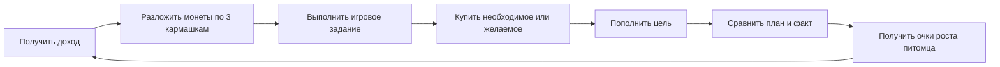
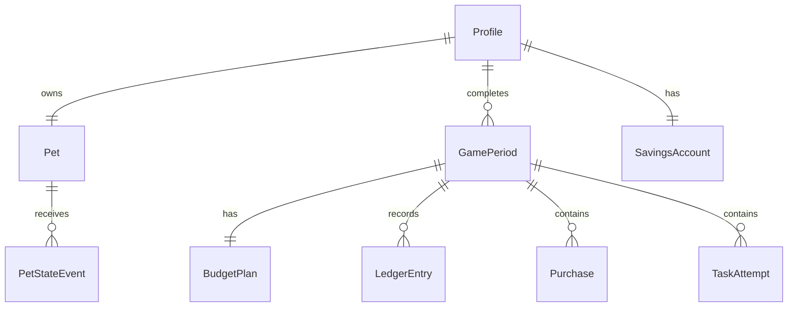

# Концепция мобильного приложения «Финни: Три кармашка»

## 1. Коротко о продукте

«Финни: Три кармашка» — офлайн-игра для Android, в которой ребёнок 7–11 лет заботится о виртуальном питомце и учится распоряжаться ограниченным количеством игровых монет.

В начале каждого игрового периода ребёнок раскладывает монеты по трём понятным «кармашкам»:

- **Забота** — обязательные расходы робота: энергобатарея, моторное масло, топливо;
- **Радость** — необязательные расходы: игрушки, украшения, развлечения;
- **Мечта** — накопления на выбранную цель.

После планирования ребёнок выполняет короткое интерактивное задание, получает доход, совершает покупки и пополняет накопления. В конце периода приложение сравнивает план с фактом и простыми словами объясняет, как решения повлияли на баланс, цель и питомца.

Главная продуктовая идея: **не давать ребёнку готовый «правильный ответ», а позволить сделать выбор, сразу увидеть последствие и безопасно скорректировать решение**.

## 2. Ценность и образовательный результат

Приложение формирует четыре базовых навыка:

1. Понимание ограниченности денег: купить всё сразу нельзя.
2. Различение необходимого и желаемого.
3. Планирование трат и сравнение плана с фактом.
4. Регулярное накопление на короткую и понятную цель.

Питомец выполняет роль живой обратной связи. Его текущее настроение меняется сразу после отдельных действий, а стадия развития — только по результатам нескольких периодов. Ошибки не приводят к болезни, смерти или потере уже достигнутого прогресса.

## 3. Пользователи

### Ребёнок

Основной пользователь: создаёт питомца, планирует бюджет, получает и тратит игровую валюту, выполняет задания, копит на цель и наблюдает за развитием персонажа.

### Взрослый

Поддерживающий пользователь: в отделённом разделе видит образовательные темы и общий прогресс без оценок «плохо/хорошо», может сбросить демонстрационный профиль или удалить все локальные данные.

Регистрация, реальное имя, телефон, e-mail и сведения о семейном бюджете не используются.

## 4. Основной игровой цикл



Один период — условная игровая неделя без обязательной привязки к реальному календарю. В обычном режиме новый период открывается после завершения текущего. В демонстрационном режиме пять периодов можно пройти подряд без ожидания.

## 5. Навигация

Нижняя навигация содержит пять постоянных разделов:

1. **Домой** — питомец и вся ключевая информация.
2. **Бюджет** — план и фактическое исполнение.
3. **Задания** — игровые финансовые ситуации.
4. **Магазин** — обязательные и необязательные покупки.
5. **Прогресс** — история периодов, развитие и словарик.

Карточка «Мечта» на главном экране открывает накопления. Раздел взрослого доступен из настроек профиля через защитный барьер.

## 6. Экраны приложения

| № | Экран | Что видит пользователь | Основные действия |
|---|---|---|---|
| 1 | Первый запуск | Три короткие карточки: «Позаботься», «Порадуй», «Отложи на мечту» | Пролистать, включить озвучивание, открыть подсказку, начать игру или деморежим |
| 2 | Локальный профиль | Выбор игрового аватара и поле игрового псевдонима | Создать профиль без регистрации и персональных данных |
| 3 | Создание питомца | Тип питомца, цвет, аксессуар, поле имени | Собрать минимум 9 визуально разных комбинаций, назвать питомца |
| 4 | Главный экран | Питомец, баланс, накопления, цель, три показателя состояния, активное задание и этап периода одновременно | Перейти к бюджету, заданию, покупкам, цели, прогрессу или настройкам |
| 5 | План периода | Три кармашка, доступная сумма, нераспределённый остаток | Кнопками или перетаскиванием распределить монеты, изменить план, подтвердить |
| 6 | Бюджет: план и факт | Для каждого кармашка — план, факт и остаток; отдельно дополнительный доход | Понять отклонение и открыть объяснение |
| 7 | Список заданий | Карточки по темам, награда, сложность и статус | Начать доступное задание; в деморежиме все обязательные задания открыты |
| 8 | Игровое задание | Интерактивная ситуация: корзина, раскладка монет, последовательность действий или выбор товара | Манипулировать объектами, подтверждать решение, получить объяснение и награду |
| 9 | Магазин | Фильтры «Забота» и «Радость», карточки товаров с ценой и эффектом | Открыть товар, сравнить варианты |
| 10 | Подтверждение покупки | Цена, категория, остаток после покупки, влияние на питомца | Подтвердить или отменить; при нехватке увидеть безопасные альтернативы |
| 11 | Мечта | Три или более цели, стоимость, накоплено, осталось, понятный прогноз | Выбрать цель, пополнить её, подтвердить снятие или завершение цели |
| 12 | Итоги периода | План и факт, изменение баланса, вклад в цель, состояние питомца и полученные очки роста | Прочитать короткий вывод, перейти в следующий период |
| 13 | Прогресс | Стадия питомца, история периодов, выполненные задания, прогресс по темам и цели | Открыть детали периода или словарик |
| 14 | Раздел взрослого | Цели приложения, пройденные темы, число завершённых периодов, настройки данных | Отключить звук/анимацию, сбросить тестовый профиль, удалить данные |

### 6.1. Главный экран

Это главный «экран состояния», а не меню. Без прокрутки на ширине 360 dp должны одновременно помещаться:

- имя и изображение питомца;
- доступный баланс;
- сумма накоплений и текущая цель либо призыв выбрать её;
- три состояния: «Сыт», «Весёлый», «Уютно» с иконкой и текстовой подписью;
- активное задание и ожидаемая награда;
- три быстрых действия: «Распределить», «Купить», «Пополнить мечту».

После финансового действия над соответствующими карточками на 1–2 секунды появляются понятные изменения, например: «Баланс −25», «Сытость +20», «Мечта +15». Затем питомец одной фразой объясняет связь: «Мы купили энергобатарею — теперь я полон сил, а в кармашке “Забота” осталось 15 монет».

### 6.2. Планирование бюджета

На экране лежат крупные жетоны по 5 или 10 монет и три кармашка. Ребёнок может перетаскивать жетоны или пользоваться кнопками «−5 / +5».

Правила:

- сумма плана не превышает доступный на начало периода бюджет;
- нераспределённая часть показывается как «Свободно»;
- до подтверждения значения можно менять сколько угодно;
- после подтверждения план фиксируется, но не блокирует все отклонения — это позволяет сравнить план с реальными решениями;
- перед подтверждением приложение предупреждает, если обязательным расходам не хватает на минимальный набор, но не стыдит пользователя.

Пример подсказки: «На энергобатарею и моторное масло нужно 45 монет. В “Заботе” пока 25. Добавим 20 или попробуем исправить это заданием?»

### 6.3. Покупки

Перед покупкой видны:

- название и изображение;
- цена;
- категория с иконкой и словом, а не только цветом;
- предполагаемый эффект;
- остаток баланса и факт по соответствующей категории после покупки.

При нехватке денег покупка не выполняется, отрицательный баланс невозможен. Вместо тупика показывается нижняя панель:

> Не хватает 5 монет. Можно выбрать дешевле, выполнить задание или перенести покупку на следующую неделю.

### 6.4. Накопления

Минимальный набор целей:

- реактивный самокат — 80 монет;
- реактивный мотоцикл — 120 монет;
- поездка в планетарий — 160 монет;
- реактивная машина — 200 монет.

Для активной цели отображаются стоимость, накопленная сумма, остаток и линейка прогресса. Если выполнено хотя бы два пополнения, можно показать прогноз: «Если откладывать по 20, понадобится ещё 5 недель». Расчёт открывается по кнопке «Как посчитано?».

Снятие из накоплений требует отдельного подтверждения: «Забрать 10? На мотоцикл останется 35 из 120, а путь станет примерно на одну неделю длиннее».

## 7. Игровые задания

Задания не сводятся к выбору ответа. Каждое требует действия с игровыми объектами и заканчивается коротким объяснением независимо от результата.

Минимальный демонстрационный набор:

| Тема | Задание | Механика | Чему учит |
|---|---|---|---|
| Планирование | «Разложи 60 монет» | Перетащить монеты в три кармашка при заданном минимуме обязательных расходов | Распределять ограниченный бюджет |
| Планирование | «Разрядилась батарея» | Пересобрать уже составленный план, убрав или перенеся желаемую покупку | Корректировать план при непредвиденном расходе |
| Сбережения | «Дорога к мотоциклу» | Собрать последовательность из нескольких регулярных взносов | Видеть эффект регулярности |
| Сбережения | «Взять сейчас или сохранить?» | Передвинуть жетоны между балансом и целью и увидеть изменение срока | Понимать цену снятия накоплений |
| Покупки | «Собери набор заботы» | Положить в корзину нужные товары и не выйти за лимит | Отличать обязательное от желаемого |
| Покупки | «Сравни две упаковки» | Сопоставить цену и количество, затем оплатить выбранную корзину | Сравнивать варианты покупки |

Формат контента строится на шаблонах заданий (`budget_drag`, `basket`, `sequence`, `compare`). Поэтому новое задание добавляется через JSON и ресурсы без изменения навигации и основной игровой логики.

## 8. Обратная связь и безопасная ошибка

У приложения три уровня обратной связи:

1. **Мгновенная:** изменение числа и показателя сразу после действия.
2. **Поясняющая:** одна фраза «что изменилось и почему».
3. **Итоговая:** сравнение плана и факта в конце периода.

Примеры:

- Удачное решение: «Ты сначала купил воду, а потом игрушку. Всё нужное есть, и на мечту осталось 20».
- Отклонение от плана: «На радости ушло на 10 больше, чем планировали. Ничего страшного: в следующей неделе можно выбрать одну игрушку вместо двух».
- Не выполнена обязательная покупка: «Заряда хватит до следующей недели. Начнём новый план с кармашка “Забота”».
- Накопления меньше плана: «Сегодня отложили 5 из 15. Можно выполнить задание или продолжить в следующей неделе».

Ни одно сообщение не использует формулировки «ты проиграл», «ты плохой хозяин» или угрозу питомцу.

## 9. Состояние и развитие питомца

### Текущее состояние

Три обратимых показателя от 0 до 100:

- сытость;
- настроение;
- уют.

В интерфейсе число можно скрыть за простыми уровнями «нужна забота / всё хорошо / отлично», но оно хранится в модели для расчётов. Сытость связана с реальной активностью пользователя: системный шагомер уменьшает её на 1 за каждые 500 новых шагов. Энергообувь из категории «Радость» — постоянное улучшение за 60 монет: после покупки порог увеличивается до 1000 шагов. Реактивный рюкзак за 100 монет увеличивает порог до 1500 шагов, а вместе с обувью — до 2000. Повторное открытие приложения не списывает уже учтённые шаги. Моторное масло и энергобатарея восстанавливают сытость, а настроение и уют мягко меняются между игровыми периодами. Минимальное значение не сопровождается болезнью или пугающей анимацией.

Подсчёт запускается только после контекстного согласия пользователя. Если разрешение не выдано или на устройстве нет датчика шагов, финансовый сценарий остаётся полностью доступным, а главный экран показывает понятное объяснение.

### Стадии развития

1. **Малыш** — 0–29 очков роста.
2. **Исследователь** — 30–69 очков.
3. **Знаток** — 70 и более очков.

За период можно получить до 20 очков:

- до 10 — обязательные потребности обеспечены;
- до 5 — фактические траты соответствуют плану;
- до 5 — выполнен план накоплений.

Очки роста никогда не отнимаются. При неудачном периоде питомец просто растёт медленнее. При максимально последовательных решениях вторая стадия открывается после двух периодов, третья — после четырёх, поэтому все три стадии демонстрируются в обязательных пяти периодах.

## 10. Игровая экономика

Все суммы целые; дробных монет нет.

### Базовый период

- стартовый доход: 100 монет;
- награда за задание: 10–20 монет;
- обязательные покупки: 10–40 монет;
- необязательные покупки: 8–50 монет;
- рекомендуемое накопление: 10–25 монет.

### Формулы и ограничения

```text
план_заботы + план_радости + план_мечты <= баланс_на_момент_планирования

доступный_баланс =
  сумма_доходов
  - сумма_покупок
  - пополнения_накоплений
  + подтверждённые_снятия_из_накоплений

доступный_баланс >= 0
накопления >= 0
```

План не переписывается после подтверждения. Доход от задания, полученный позже, отмечается в итогах как «дополнительный доход», благодаря чему ребёнок видит разницу между исходным планом и новыми возможностями.

## 11. Модель данных

### 11.1. Локальные сущности

| Сущность | Ключевые поля | Назначение |
|---|---|---|
| `Profile` | `id`, `nickname`, `isDemo`, `onboardingCompleted`, `currentPeriodId`, `createdAt` | Локальный игровой профиль |
| `Pet` | `id`, `profileId`, `name`, `speciesId`, `colorId`, `accessoryId`, `hasShoes`, `hasGlasses`, `hasJetpack`, `stage`, `growthPoints`, `satiety`, `mood`, `comfort` | Внешность, постоянная экипировка, состояние и развитие питомца |
| `GamePeriod` | `id`, `profileId`, `number`, `status`, `openingBalance`, `startedAt`, `completedAt` | Один завершённый цикл решений |
| `BudgetPlan` | `periodId`, `requiredPlanned`, `optionalPlanned`, `savingsPlanned`, `bufferPlanned`, `confirmedAt` | Зафиксированный план периода |
| `LedgerEntry` | `id`, `profileId`, `periodId`, `type`, `category`, `amount`, `sourceId`, `balanceAfter`, `explanationKey`, `createdAt` | Единая объяснимая история всех начислений и списаний |
| `Purchase` | `id`, `periodId`, `catalogItemId`, `ledgerEntryId`, `price`, `effectSnapshot` | Фактическая покупка и применённый эффект |
| `SavingsAccount` | `profileId`, `goalId`, `amount`, `selectedAt`, `completedAt` | Активная цель и накопленная сумма |
| `TaskAttempt` | `id`, `profileId`, `periodId`, `taskId`, `result`, `reward`, `completedAt` | Пройденные задания и выданные награды |
| `PetStateEvent` | `id`, `petId`, `periodId`, `reason`, `satietyDelta`, `moodDelta`, `comfortDelta`, `growthDelta` | Объяснимое изменение состояния |
| `AppSettings` | `profileId`, `soundEnabled`, `animationEnabled`, `largeTextHintShown` | Настройки доступности и интерфейса |

`LedgerEntry` — источник истины для баланса. Начисление, покупка, вклад в цель и снятие оформляются атомарной транзакцией: запись истории, изменение баланса/накоплений и событие состояния сохраняются вместе.

### 11.2. Контент вне кода интерфейса

В `assets/content` хранятся версионируемые JSON-файлы:

- `tasks.json` — шаги, допустимые действия, награда и объяснения;
- `shop_items.json` — категория, цена, эффект и ресурсы товара;
- `goals.json` — цели, стоимость и награда за завершение;
- `period_templates.json` — доход, обязательные потребности и события;
- `glossary.json` — короткие определения;
- `pet_customization.json` — виды, цвета, аксессуары и стадии.

У каждой записи есть стабильный `id`, `contentVersion` и ссылки на локальные ресурсы. Обновление контента не требует изменения схемы пользовательского прогресса.

### 11.3. Связи



## 12. Пример пользовательского сценария

1. **Первый запуск.** Маша видит три карточки: «Сначала нужное», «Потом желаемое», «Понемногу на мечту». Регистрация не требуется.
2. **Профиль.** Она выбирает игровой псевдоним «Искорка» без указания реального имени.
3. **Питомец.** Выбирает мятного лиса-ровера, оставляет его без аксессуара и называет Плюш.
4. **Старт.** На главном экране одновременно видны Плюш, баланс 100, накопления 0, карточка «Выбери мечту», состояния питомца, активность и задание с наградой 15. Маша разрешает подсчёт шагов.
5. **План.** Маша распределяет 50 в «Заботу», 25 в «Радость», 20 в «Мечту», оставляет 5 свободными и подтверждает план.
6. **Задание.** В ситуации «Заряди героя» она кладёт в корзину моторное масло, энергобатарею и лишнее украшение, выходит за лимит, убирает украшение и получает объяснение и 15 монет. Баланс становится 115, источник дохода указан в истории.
7. **Покупки.** Маша покупает энергобатарею за 35 и защитный шлем за 25. Сытость и настроение растут, а изображение героя сразу меняется на версию в шлеме. Смарт-очки за 35 дополнительно повышают настроение на 30 и остаются на герое. При первой попытке купить реактивный рюкзак с недостаточным балансом приложение не списывает деньги и предлагает выполнить задание или отложить покупку. Позже Маша накапливает нужную сумму и покупает энергообувь за 60 и рюкзак за 100: герой появляется в новой экипировке, а сытость теперь уменьшается только раз в 2000 шагов.
8. **Мечта.** Маша выбирает реактивный мотоцикл стоимостью 120 и переводит 20 монет. Баланс становится 45, накопления — 20 из 120.
9. **Обратная связь.** На главном экране видны изменения: «Баланс 45», «Мечта 20/120», число учтённых шагов и оставшееся расстояние до следующего снижения сытости. Каждое изменение имеет короткое объяснение.
10. **Итоги недели.** Приложение показывает: «Забота: план 50 / факт 35», «Радость: 25 / 15», «Мечта: 20 / 20», «Дополнительный доход: +15». Плюш получает 20 очков роста. После следующего удачного периода он переходит в стадию «Исследователь».
11. **Сохранение.** Маша закрывает приложение и запускает снова. Баланс, покупки, цель, состояние и история восстановлены.
12. **Раздел взрослого.** Родитель удерживает кнопку три секунды и решает простой пример. Он видит, что пройдены темы «Покупки» и «Сбережения», затем может сбросить тестовый профиль. В демонстрационном режиме эксперт последовательно проходит пять периодов и показывает все три стадии питомца.

## 13. Демонстрационный контент

- Питомцы: 3 вида × 3 цвета, плюс аксессуары — не менее 9 визуально различимых комбинаций.
- Периоды: 5 последовательных шаблонов, запускаемых без ожидания.
- Задания: 6, по 2 на каждую из 3 тем, с успешным и ошибочным путём.
- Магазин: 8 позиций — 4 обязательных и 4 необязательных.
- Цели: 4.
- Стадии питомца: 3.
- Тестовый профиль: фиксированный стартовый баланс, доступный контент, мгновенный переход периода и полный сброс.

## 14. Техническая концепция

Рекомендуемый стек для Android-прототипа:

- Kotlin, Jetpack Compose, Material 3;
- MVVM с однонаправленным потоком состояния;
- Room для профиля, журнала операций и прогресса;
- DataStore для небольших настроек;
- локальные JSON-репозитории для учебного контента;
- Navigation Compose;
- Coroutines/Flow;
- минимум Android 8.0, портретный интерфейс от 360 dp.

Логические компоненты:

- `BudgetEngine` — проверка плана и расчёт плана/факта;
- `LedgerService` — атомарные начисления и списания;
- `SavingsEngine` — цель, взносы, снятие и прогноз срока;
- `PetStateEngine` — мгновенные состояния и очки роста;
- `TaskEngine` — выполнение шаблонных интерактивных заданий;
- `ContentRepository` — чтение и проверка версий JSON;
- `DemoProfileManager` — создание и сброс тестового профиля.

Сервер не нужен. Основной цикл полностью работает офлайн. Приложение не запрашивает камеру, микрофон, геолокацию, контакты или платёжные разрешения.

## 15. UX, доступность и безопасность

- интерактивная область не меньше 48 × 48 dp;
- основной текст — от 16 sp с поддержкой системного масштаба;
- короткие фразы, один основной призыв к действию на экран;
- категория и состояние передаются иконкой, подписью и цветом одновременно;
- единая кнопка возврата и предсказуемая нижняя навигация;
- звук и декоративные анимации отключаются;
- при отключённой анимации все изменения остаются понятны по тексту и числам;
- удаление профиля, сброс и снятие накоплений требуют подтверждения;
- нет рекламы, реальных платежей, внешних ссылок в детском интерфейсе и персонализированных финансовых советов;
- нет случайных платных наград, рейтингов, чатов и социальных механик;
- запуск и все локальные действия не зависят от сети.

## 16. Границы MVP

В первый релиз входят только функции, нужные для полного сквозного сценария: локальный профиль, создание питомца, системный подсчёт шагов, связь шагов с сытостью, пять периодов, три кармашка, покупки, накопления, шесть заданий, план/факт, три стадии, история, раздел взрослого и деморежим.

После устойчивой реализации MVP можно добавить новые виды питомцев, дополнительные шаблоны заданий, сезонные локальные наборы контента, планшетную компоновку и озвучивание. Эти улучшения не должны заменять базовый цикл финансового выбора.

## 17. Критерии готовности концепции к прототипированию

Прототип можно считать продуктово готовым к реализации, если:

1. Все 12 шагов обязательного сценария проходятся без тупиков.
2. На главном экране одновременно видны питомец, баланс, накопления, цель, состояния и задание.
3. Любое изменение баланса имеет источник и объяснение.
4. Нельзя получить отрицательный баланс или отрицательные накопления.
5. Можно пройти как удачный, так и ошибочный путь и восстановиться.
6. После перезапуска полностью сохраняется состояние.
7. Эксперт может пройти пять периодов подряд и сбросить тестовый профиль.
8. Новый контент добавляется данными, а не переписыванием основной логики.
